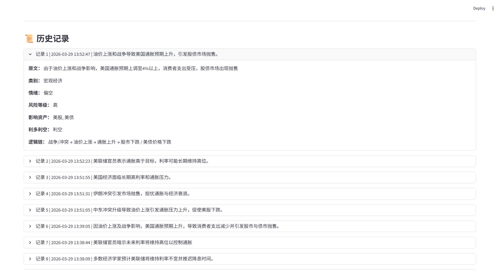
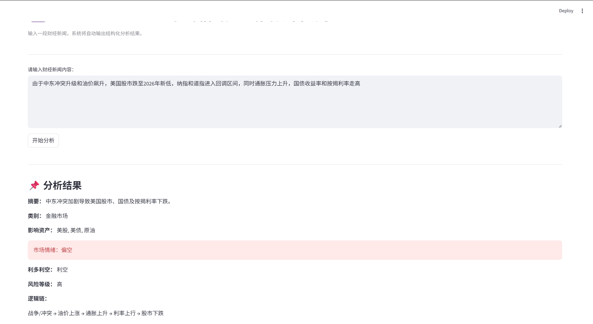

# 📈 MarketPulse：AI 市场情绪与新闻分析助手

> 一个基于大模型的金融新闻结构化分析工具，帮助你快速理解市场信息与情绪。

---

## 🧠 项目简介

MarketPulse 是一个面向金融信息分析场景的 AI 应用。

用户输入一段财经新闻，系统将自动完成：

* 📌 摘要提炼
* 📊 新闻分类
* 💰 影响资产识别
* 📉 市场情绪判断
* ⚖️ 利多 / 利空分析
* 🔗 市场逻辑链生成

最终输出结构化结果，并支持历史记录与本地存储。

---

## 🎯 项目目标

构建一个完整的 AI 应用闭环：

**输入新闻 → 模型分析 → 结构化输出 → 页面展示 → 本地存储**

本项目重点训练能力：

| 能力方向   | 内容                  |
| ------ | ------------------- |
| Python | 模块化开发、JSON 处理、异常处理  |
| AI 开发  | Prompt 设计、模型调用、结果解析 |
| 工程能力   | 分层架构、代码组织、日志与存储     |
| 金融理解   | 情绪分析、资产映射、逻辑链梳理     |

---

## 🚀 功能展示

### ✅ 已实现功能（V1）

* [x] 单条财经新闻分析
* [x] 结构化结果输出
* [x] Streamlit 可视化页面
* [x] 历史记录展示
* [x] 本地 JSON 存储
* [x] 基础异常处理

### 🔜 规划功能（V2+）

* [ ] 多条新闻批量分析
* [ ] 市场情绪汇总
* [ ] 数据可视化图表
* [ ] 接入实时新闻源
* [ ] 市场复盘总结

---

## 🖥️ 项目预览






---

## 🏗️ 项目结构

```text
market_pulse/
│
├── app.py                # Streamlit 页面入口
├── config.py             # 配置文件
├── requirements.txt      # 依赖列表
├── README.md
├── .env                  # 环境变量（可选）
│
├── data/
│   └── history.json      # 本地历史记录
│
├── logs/
│   └── app.log           # 日志文件
│
└── core/
    ├── __init__.py
    ├── prompt.py         # Prompt 模板
    ├── llm.py            # 模型调用
    ├── parser.py         # 结果解析
    ├── analyzer.py       # 分析流程
    └── utils.py          # 工具函数
```

---

## ⚙️ 技术栈

| 模块 | 技术                              |
| -- | ------------------------------- |
| 前端 | Streamlit                       |
| 后端 | Python                          |
| 模型 | Ollama / API（Qwen / DeepSeek 等） |
| 存储 | JSON                            |
| 环境 | WSL + venv                      |

---

## 📦 安装与运行

### 1. 克隆项目

```bash
git clone https://github.com/Cheeswolf/market-pulse.git
cd market-pulse
```

### 2. 创建虚拟环境

```bash
python3 -m venv venv
source venv/bin/activate
```

### 3. 安装依赖

```bash
pip install -r requirements.txt
```

### 4. 配置环境变量（可选）

如果你使用 API 模型，可以在终端中配置：

```bash
export API_KEY=your_key
```

也可以写入 `.env` 文件。

### 5. 启动项目

```bash
streamlit run app.py
```

启动后在浏览器访问：

```text
http://localhost:8501
```

---

## 📊 输出结果示例

```json
{
  "summary": "美联储鹰派表态压制降息预期",
  "category": "货币政策",
  "assets": ["美元", "黄金", "美股"],
  "sentiment": "偏空",
  "impact": "利多美元，利空黄金和股市",
  "logic_chain": "鹰派发言 → 利率预期上升 → 美元走强 → 风险资产承压",
  "risk_level": "中"
}
```

---

## 🧩 核心模块说明

| 模块            | 作用               |
| ------------- | ---------------- |
| `prompt.py`   | 构建标准化 Prompt     |
| `llm.py`      | 调用大模型            |
| `parser.py`   | 解析模型输出结果         |
| `analyzer.py` | 串联完整分析流程         |
| `utils.py`    | 历史记录保存、时间处理等工具函数 |

---

## 🔁 系统流程

```text
用户输入
   ↓
Prompt 构建
   ↓
模型调用
   ↓
结果解析
   ↓
页面展示
   ↓
本地存储
```

---

## ⚠️ 已知问题

* 模型偶尔返回非标准 JSON，当前已通过 parser 做基础容错
* 本地模型响应速度可能较慢，建议优先测试短文本
* 金融结论依赖模型输出，存在一定不稳定性，仅适合作为辅助分析工具

---

## 📈 项目亮点

* 基于 Python + Streamlit + 大模型搭建完整 AI 应用闭环
* 支持财经新闻摘要、分类、情绪识别、资产影响分析与逻辑链输出
* 实现了从用户输入到页面展示再到本地存储的完整流程
* 具备一定的工程化结构，便于后续迭代扩展

---

## 📌 后续优化方向

* 接入实时新闻 API
* 联动行情数据，构建“新闻 + 行情”分析工具
* 增加批量分析与复盘总结能力
* 增加情绪统计与可视化图表
* 支持导出分析结果

---

## 📝 简历描述示例

**项目名称：** MarketPulse：AI 市场情绪与新闻分析助手

**项目描述：** 基于 Python、Streamlit 与大模型能力开发金融新闻智能分析工具，支持财经文本摘要、情绪识别、影响资产提取、利多利空判断及逻辑链生成，并实现历史记录保存与本地结构化存储。

---

## 🧑‍💻 作者

* GitHub: [Cheeswolf](https://github.com/Cheeswolf)

---

## ⭐ Star

如果这个项目对你有帮助，欢迎点一个 Star 支持一下。

